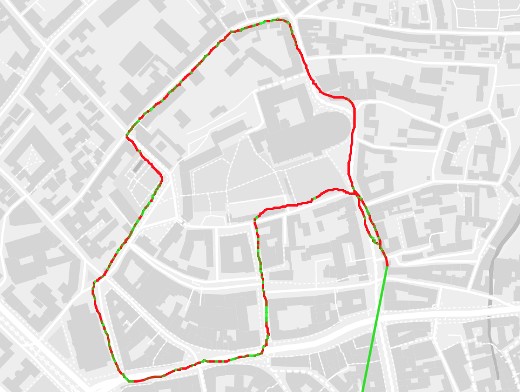
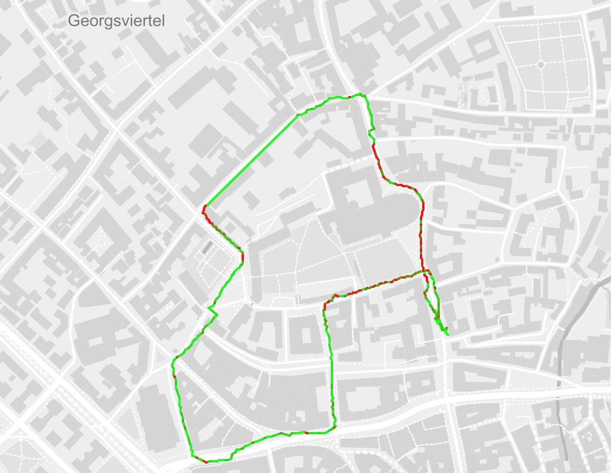
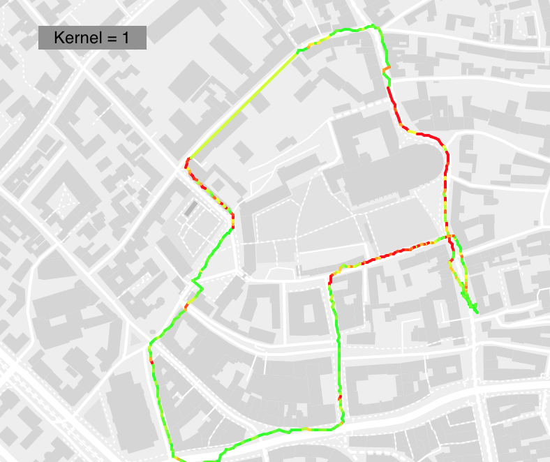
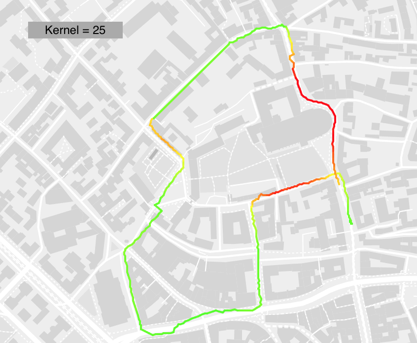

# Bykeli
TODO: Add summary

## Examples
### Runde um den Dom
#### Moritz's Rad

Interaktive Karte: data/processed/Domrunde_Moritz.csv.csv.processed_az.geojson

#### Daniel's Rad

(Ohne Kernel, altes Farbschema)  
Interaktive Karte: data/processed/Domrunde_Daniel.csv.processed_az.geojson

Interaktive Karte: data/processed/Domrunde_Daniel.csv.processed_az_kernel1.geojson

Interaktive Karte: data/processed/Domrunde_Daniel.csv.processed_az_kernel25.geojson
